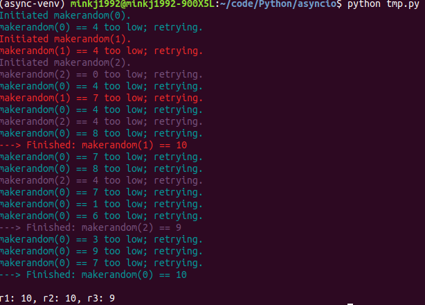

# Async IO in Python: A Complete Walkthrough
> [Real Python](https://realpython.com/async-io-python/#async-ios-roots-in-generators)


## Sync vs Async

sync
```python
#!/usr/bin/env python3
# countsync.py

import time

def count():
    print("One")
    time.sleep(1)
    print("Two")

def main():
    for _ in range(3):
        count()

if __name__ == "__main__":
    s = time.perf_counter()
    main()
    elapsed = time.perf_counter() - s
    print(f"{__file__} executed in {elapsed:0.2f} seconds.")
```
```
One
Two
One
Two
One
Two
tmp.py executed in 3.00 seconds.
```

async
```python
#!/usr/bin/env python3
# countasync.py

import asyncio

async def count():
    print("One")
    await asyncio.sleep(1) # 명시적 context change
    print("Two")

async def main():
    await asyncio.gather(count(), count(), count())

if __name__ == "__main__":
    import time
    s = time.perf_counter()
    asyncio.run(main())
    elapsed = time.perf_counter() - s
    print(f"{__file__} executed in {elapsed:0.2f} seconds.")
```

```
One
One
One
Two
Two
Two
tmp.py executed in 1.00 seconds.

```

## The Rules of Async IO
> async, await

`async def`는 2가지 역할을 합니다. 1. native coroutine 생성 2. asynchronous generator를 생성

또한 키워드 `await`는 함수 제어를 이벤트 루프로 다시 전달합니다. ("내가 기다리는 모든 것의 결과가 반환 될 때까지 실행을 일시 중지 하고 Event Loop는 그동안 다른 일을 해보자.")

- `async def`의 블록 안에서는 await, return, yield를 사용가능합니다.
    - coroutine으로 사용할 때는 await, return을 사용합니다.
    - asynchronous generator로 사용할 경우에는 블록에서 `yield`를 사용합니다. 이때 `async for`를 사용하여 iterate 할 수 있습니다.    
    - async def안에서는 `yield from`을 사용할 수 없습니다. (SyntaxError)
    - 마찬가지로 일반 def 함수에서 await을 사용하면 SyntaxError
    
  
```python
# coroutine
async def f(x):
    y = await z(x)
    return y

# async generator
async def g(x):
    yield x
    
# SyntaxError    
async def m(x):
    yield from gen(x)

# SyntaxError
def m(x):
    y = await z(x)
```


추가로 `await f()`을 사용할 때, f()는 awaitable object입니다. 
`awaitable object`이란 1) Another Coroutine(Task, Coroutine, Future) 2) Object defining __await__()입니다.

또한 `@asyncio.coroutine`문법은 async/await(native coroutine)가 python 3.5에 등장하기 전까지 사용했던 `generator-based coroutine`방식으로, python 3.10 버전에서는 사라질 예정입니다.
```python
import asyncio

@asyncio.coroutine
def py34_coro():
    """Generator-based coroutine, older syntax"""
    yield from stuff()

async def py35_coro():
    """Native coroutine, modern syntax"""
    await stuff()
```

다음 코드는 random하게 i를 만들면서 만약 `threshold`와 i가 같으면 중지하는 코루틴들을 보여주는 코드입니다.
이를 통해 전반적인 asyncio의 동작을 확인 할 수 있다.
```python
#!/usr/bin/env python3
# rand.py

import asyncio
import random

# ANSI colors
c = (
    "\033[0m",  # End of color
    "\033[36m",  # Cyan
    "\033[91m",  # Red
    "\033[35m",  # Magenta
)


async def makerandom(idx: int, threshold: int = 6) -> int:
    print(c[idx + 1] + f"Initiated makerandom({idx}).")
    i = random.randint(0, 10)
    while i <= threshold:
        print(c[idx + 1] + f"makerandom({idx}) == {i} too low; retrying.")
        await asyncio.sleep(idx + 1)
        i = random.randint(0, 10)
    print(c[idx + 1] + f"---> Finished: makerandom({idx}) == {i}" + c[0])
    return i


async def main():
    res = await asyncio.gather(*(makerandom(i, 10 - i - 1) for i in range(3)))
    return res


if __name__ == "__main__":
    random.seed(444)
    r1, r2, r3 = asyncio.run(main())
    print()
    print(f"r1: {r1}, r2: {r2}, r3: {r3}")

```



결과를 보면 idx의 크기에 따라 sleep 시간을 길게두어 `Cyan`이 가장 높은 context change 권한을 가졌던것을 볼 수 있다.
참고로 이야기 하면, 위의 코드는 single thread에서(엄밀하게는 main에서 동작하는 EventLoop thread도 존재할 것같다. node.js처럼) 코루틴들에 대해 권한을 바꿔가며 동작하는 concurrency한 코드이다.


## Async IO Design Patterns

### Chaining Coroutines
```python
#!/usr/bin/env python3
# chained.py

import asyncio
import random
import time

async def part1(n: int) -> str:
    i = random.randint(0, 10)
    print(f"part1({n}) sleeping for {i} seconds.")
    await asyncio.sleep(i)
    result = f"result{n}-1"
    print(f"Returning part1({n}) == {result}.")
    return result

async def part2(n: int, arg: str) -> str:
    i = random.randint(0, 10)
    print(f"part2{n, arg} sleeping for {i} seconds.")
    await asyncio.sleep(i)
    result = f"result{n}-2 derived from {arg}"
    print(f"Returning part2{n, arg} == {result}.")
    return result

async def chain(n: int) -> None:
    start = time.perf_counter()
    p1 = await part1(n)
    p2 = await part2(n, p1)
    end = time.perf_counter() - start
    print(f"-->Chained result{n} => {p2} (took {end:0.2f} seconds).")

async def main(*args):
    await asyncio.gather(*(chain(n) for n in args))

if __name__ == "__main__":
    import sys
    random.seed(444)
    args = [1, 2, 3] if len(sys.argv) == 1 else map(int, sys.argv[1:])
    start = time.perf_counter()
    asyncio.run(main(*args))
    end = time.perf_counter() - start
    print(f"Program finished in {end:0.2f} seconds.")
```

```
$ python tmp.py
part1(1) sleeping for 4 seconds.
part1(2) sleeping for 4 seconds.
part1(3) sleeping for 0 seconds.
Returning part1(3) == result3-1.
part2(3, 'result3-1') sleeping for 4 seconds.
Returning part1(1) == result1-1.
part2(1, 'result1-1') sleeping for 7 seconds.
Returning part1(2) == result2-1.
part2(2, 'result2-1') sleeping for 4 seconds.
Returning part2(3, 'result3-1') == result3-2 derived from result3-1.
-->Chained result3 => result3-2 derived from result3-1 (took 4.00 seconds).
Returning part2(2, 'result2-1') == result2-2 derived from result2-1.
-->Chained result2 => result2-2 derived from result2-1 (took 8.01 seconds).
Returning part2(1, 'result1-1') == result1-2 derived from result1-1.
-->Chained result1 => result1-2 derived from result1-1 (took 11.01 seconds).
Program finished in 11.01 seconds.

```

```
$ python tmp.py 9 6 3
part1(9) sleeping for 4 seconds.
part1(6) sleeping for 4 seconds.
part1(3) sleeping for 0 seconds.
Returning part1(3) == result3-1.
part2(3, 'result3-1') sleeping for 4 seconds.
Returning part1(9) == result9-1.
part2(9, 'result9-1') sleeping for 7 seconds.
Returning part1(6) == result6-1.
part2(6, 'result6-1') sleeping for 4 seconds.
Returning part2(3, 'result3-1') == result3-2 derived from result3-1.
-->Chained result3 => result3-2 derived from result3-1 (took 4.00 seconds).
Returning part2(6, 'result6-1') == result6-2 derived from result6-1.
-->Chained result6 => result6-2 derived from result6-1 (took 8.00 seconds).
Returning part2(9, 'result9-1') == result9-2 derived from result9-1.
-->Chained result9 => result9-2 derived from result9-1 (took 11.01 seconds).
Program finished in 11.01 seconds.

```

### Using a Queue

```python
#!/usr/bin/env python3
# asyncq.py

import asyncio
import itertools as it
import os
import random
import time

async def makeitem(size: int = 5) -> str:
    return os.urandom(size).hex()

async def randsleep(a: int = 1, b: int = 5, caller=None) -> None:
    i = random.randint(0, 10)
    if caller:
        print(f"{caller} sleeping for {i} seconds.")
    await asyncio.sleep(i)

async def produce(name: int, q: asyncio.Queue) -> None:
    n = random.randint(0, 10)
    for _ in it.repeat(None, n):  # Synchronous loop for each single producer
        await randsleep(caller=f"Producer {name}")
        i = await makeitem()
        t = time.perf_counter()
        await q.put((i, t))
        print(f"Producer {name} added <{i}> to queue.")

async def consume(name: int, q: asyncio.Queue) -> None:
    while True:
        await randsleep(caller=f"Consumer {name}")
        i, t = await q.get()
        now = time.perf_counter()
        print(f"Consumer {name} got element <{i}>"
              f" in {now-t:0.5f} seconds.")
        q.task_done()

async def main(nprod: int, ncon: int):
    q = asyncio.Queue()
    producers = [asyncio.create_task(produce(n, q)) for n in range(nprod)]
    consumers = [asyncio.create_task(consume(n, q)) for n in range(ncon)]
    await asyncio.gather(*producers)
    await q.join()  # Implicitly awaits consumers, too
    for c in consumers:
        c.cancel()

if __name__ == "__main__":
    import argparse
    random.seed(444)
    parser = argparse.ArgumentParser()
    parser.add_argument("-p", "--nprod", type=int, default=5)
    parser.add_argument("-c", "--ncon", type=int, default=10)
    ns = parser.parse_args()
    start = time.perf_counter()
    asyncio.run(main(**ns.__dict__))
    elapsed = time.perf_counter() - start
    print(f"Program completed in {elapsed:0.5f} seconds.")
```

```
Producer 0 sleeping for 4 seconds.
Consumer 0 sleeping for 4 seconds.
Consumer 1 sleeping for 7 seconds.
Consumer 2 sleeping for 4 seconds.
Consumer 3 sleeping for 4 seconds.
Consumer 4 sleeping for 8 seconds.
Producer 0 added <f1cfedbead> to queue.
Producer 0 sleeping for 10 seconds.
Consumer 0 got element <f1cfedbead> in 0.00031 seconds.
Consumer 0 sleeping for 7 seconds.
Producer 0 added <c714f0d0fa> to queue.
Producer 0 sleeping for 8 seconds.
Consumer 2 got element <c714f0d0fa> in 0.00014 seconds.
Consumer 2 sleeping for 4 seconds.
Producer 0 added <df873d53d6> to queue.
Producer 0 sleeping for 7 seconds.
Consumer 3 got element <df873d53d6> in 0.00010 seconds.
Consumer 3 sleeping for 1 seconds.
Producer 0 added <7333eaeb62> to queue.
Consumer 1 got element <7333eaeb62> in 0.00009 seconds.
Consumer 1 sleeping for 6 seconds.
Program completed in 29.01826 seconds.

```