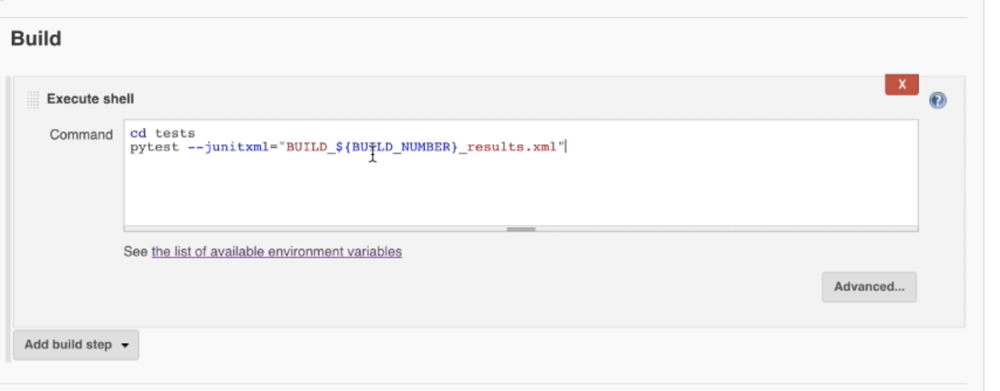
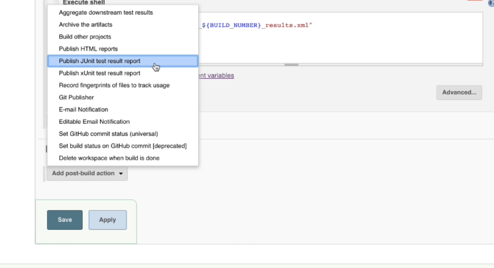
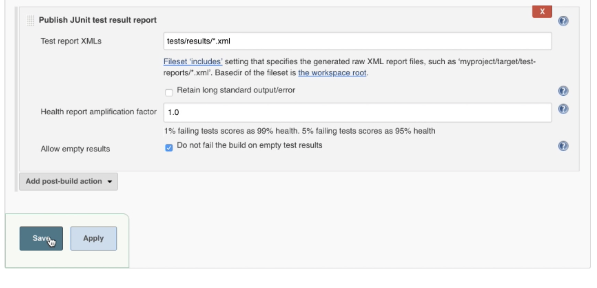

# pytest
> [udemy 강좌](https://www.udemy.com/course/elegant-automation-frameworks-with-python-and-pytest)

pytest 기능 각각을 주제로 소스코드를 추가함.

- [marker](./mark)
- [cli](./cli)
- [fixture](./fixture)
- [tox](./tox-example)
- [parameterize](./parameterize)
- [parallel](./parallel)

## marker

- custom marker의 경우 pytest.ini에 설명을 추가해주어야 warning이 뜨지 않는다.
- smoke test?
  - 핵심 feature를 테스트하는 suite
  - @mark.smoke를 만들면 좋을 듯

```bash
$ pytest -v # verbose
$ pytest -m smoke # mark
$ pytest -m "engine or body"
$ pytest -m "not smoke"
$ pytest --markers # custom markers의 설명들을 볼 수 있다.
@pytest.mark.smoke: All critical smoke tests

@pytest.mark.body: All car body tests

@pytest.mark.engine: All car engine tests

@pytest.mark.entertainment: All tests covering the entertainments system
```

## fixture

```bash
$ pytest . -s # stdout print
```

## cov

```bash
$ pip install pytest-html
$ pytest --html="report.html"  # html
$ pytest --junitxml="report.xml" # for jenkins ci
```

- xml을 활용해 jenkins에 연동하는 방법





## cli
- `def pytest_addoption(parser)`를 통해 pytest에 커스텀 option 추가 가능
- `@fixture(autouse=True)`를 활용해서, 동적으로 fixture에 맞게 skip을 할 수 있다.

```bash
$ pytest --phase=sdb

===================================================================================== test session starts ======================================================================================
platform darwin -- Python 3.8.6, pytest-6.2.3, py-1.10.0, pluggy-0.13.1 -- /Users/kakao/.pyenv/versions/3.8.6/bin/python3.8
cachedir: .pytest_cache
rootdir: /Users/kakao/code/minkj1992/Python/pytest/cli, configfile: pytest.ini
collected 4 items                                                                                                                                                                              

test_phase.py::test_phase_is_dev SKIPPED (skipped on this phase: sdb)
test_phase.py::test_phase_is_sandbox PASSED
test_phase.py::test_phase_is_beta SKIPPED (skipped on this phase: sdb)
test_phase.py::test_phase_is_production SKIPPED (skipped on this phase: sdb)
```

## parameterize
- json 파일을 load해서 parameterize 할 수 있다.
- decorator / fixture 형식으로 parameterize를 줄 수 있다.
```bash
$ tox

... 중략 ...
test_company.py::test_company_with_decorator_param[naver] PASSED           [  8%]
test_company.py::test_company_with_decorator_param[kakao] PASSED           [ 16%]
test_company.py::test_company_with_decorator_param[microsoft] PASSED       [ 25%]
test_company.py::test_company_with_decorator_param[github] PASSED          [ 33%]
test_company.py::test_company_with_fixture_param[naver] PASSED             [ 41%]
test_company.py::test_company_with_fixture_param[kakao] PASSED             [ 50%]
test_company.py::test_company_with_fixture_param[microsoft] PASSED         [ 58%]
test_company.py::test_company_with_fixture_param[github] PASSED            [ 66%]
test_company.py::test_browser_can_navigate_to_company_homepage[/Users/kakao/.wdm/drivers/chromedriver/mac64/93.0.4577.63/chromedriver-naver] PASSED [ 75%]
test_company.py::test_browser_can_navigate_to_company_homepage[/Users/kakao/.wdm/drivers/chromedriver/mac64/93.0.4577.63/chromedriver-kakao] PASSED [ 83%]
test_company.py::test_browser_can_navigate_to_company_homepage[/Users/kakao/.wdm/drivers/chromedriver/mac64/93.0.4577.63/chromedriver-microsoft] PASSED [ 91%]
test_company.py::test_browser_can_navigate_to_company_homepage[/Users/kakao/.wdm/drivers/chromedriver/mac64/93.0.4577.63/chromedriver-github] PASSED [100%]

=============================== 12 passed in 5.67s ===============================
____________________________________ summary _____________________________________
  py38: commands succeeded
  congratulations :)
```

## tox
> https://tox.readthedocs.io/en/latest/#basic-example
### What is tox?
- tox는 다양한 파이썬 버전에 맞는 분리된 환경(`virtualenv`)에서 테스트를 할 수 있도록 해준다.
- CI의 프론트 역활을 할 수 있다. (*greatly reducing boilerplate and merging CI and shell-based testing.*)
- 


### About
- `tox.ini` 파일과 (optional for packaging)`setup.py`을 같은 디렉토리에 넣어두어야 한다. (default)
- `pytest.ini`와 `tox.ini`


```ini
# content of: tox.ini , put in same dir as setup.py
[tox]
envlist = py38 # 사용할 가상환경들

[testenv]
deps = pytest # test에 필요한 dependencies
commands = 
    pytest -v # 사용할 명령어

[pytest] # pytest.ini 파일
python_classes = *Tests
python_functions = test_*
python_files = test_*
```

## parallel

