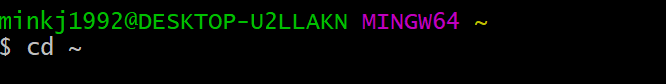

# **`Window`** 개발 환경 세팅편
>  처음부터 싹 다 지우고 차근차근 시작 해봅시다.

> python 디렉토리 설정 부터 가상환경 셋팅 및 pip 버전 관리까지 합니다.

> Ubuntu 사용자 또는 mac의 경우에는 conda env 추천합니다.

## 1. _`파이썬편(지우기)`_
-----------------------------
### 1-1 exe 파일을 실행한다. 


<div style="text-align:center; margin-left: auto;margin-right: auto;"></div>

### 1-2 exe 파일을 실행한다. 

- `Uninstall`를 클릭하여 제거 완료한다. 
<div style="text-align:center; margin-left: auto;margin-right: auto;"></div>

### 1-3 혹시 모를 환경 변수를 제거한다. 

- 1-3-1 `제어판`>`시스템 및 보안`>`시스템`>`고급시스템 설정` 을 클릭한다.
<br/><br/><br/><br/>

<div style="text-align:center; margin-left: auto;margin-right: auto;"></div>
<br/><br/><br/><br/>


- 1-3-2 `환경변수` 클릭
<div style="text-align:center; margin-left: auto;margin-right: auto;"></div>
<br/><br/><br/><br/>

- 1-3-3 `사용자 변수`> `Path` 더블 클릭
<br/><br/>
<div style="text-align:center; margin-left: auto;margin-right: auto;"></div>
<br/><br/><br/><br/>

- 1-3-4 `python`이 적혀있는 모든 녀석들 오른쪽에 있는 `삭제` 버튼 클릭하여 제거한다.

<br/><br/>
<div style="text-align:center; margin-left: auto;margin-right: auto;"></div>
<br/><br/>
<div style="text-align:center; margin-left: auto;margin-right: auto;"></div>
<br/><br/><br/><br/>

- 1-3-5 마찬가지로 `시스템 변수`> `Path` 더블 클릭 후 `python`이 적혀있는 모든 녀석들 `삭제`한다.
<br/><br/>
<div style="text-align:center; margin-left: auto;margin-right: auto;"></div>
<br/><br/><br/><br/>

### 1-3 초기화 끝
<br/><br/>
### 2. _`파이썬편(깔기)`_
-----------------------------

<div style="text-align:center; margin-left: auto;margin-right: auto;"></div>
<br/><br/><br/><br/>
<div style="text-align:center; margin-left: auto;margin-right: auto;"></div>
<br/><br/><br/><br/>
<div style="text-align:center; margin-left: auto;margin-right: auto;"></div>
<br/><br/><br/><br/>

- 여기가 진짜 중요하다.
    - `C:\python`을 넣어준다. (이후 가상환경 설치를 위하여 모두 통일해주자 ^^)  
<div style="text-align:center; margin-left: auto;margin-right: auto;"></div>
<br/><br/><br/><br/>
<div style="text-align:center; margin-left: auto;margin-right: auto;"></div>
<br/><br/><br/><br/>


## 2. _`Git Bash(지우고 다시깔기)`_ 편
-----------------------------

<br/>
<div style="text-align:center; margin-left: auto;margin-right: auto;"></div>
<br/><br/>

<div style="text-align:center; margin-left: auto;margin-right: auto;"></div>
<br/><br/>

<div style="text-align:center; margin-left: auto;margin-right: auto;"></div>
<br/><br/>

<div style="text-align:center; margin-left: auto;margin-right: auto;"></div>
<br/><br/>

- `Vim` 으로 하셔도 상관없는데 visual code로 하면 훨씬 편해서 개인적으로 추천

<div style="text-align:center; margin-left: auto;margin-right: auto;"></div>
<br/><br/>
<div style="text-align:center; margin-left: auto;margin-right: auto;"></div>
<br/><br/>
<div style="text-align:center; margin-left: auto;margin-right: auto;"></div>
<br/><br/>
<div style="text-align:center; margin-left: auto;margin-right: auto;"></div>
<br/><br/>
<div style="text-align:center; margin-left: auto;margin-right: auto;"></div>
<br/><br/>
<div style="text-align:center; margin-left: auto;margin-right: auto;"></div>
<br/><br/>
<div style="text-align:center; margin-left: auto;margin-right: auto;"></div>
<br/><br/>
<div style="text-align:center; margin-left: auto;margin-right: auto;"></div>
<br/><br/>
<div style="text-align:center; margin-left: auto;margin-right: auto;"></div>
<br/><br/>
<div style="text-align:center; margin-left: auto;margin-right: auto;"></div>
<br/><br/>
<div style="text-align:center; margin-left: auto;margin-right: auto;"></div>
<br/>


## 3. _`Python 가상환경(virtualenvwrapper) 설정편`_ 
-----------------------------

- 3-0  `git bash`를 실행한다. 

<br/><br/>
<div style="text-align:center; margin-left: auto;margin-right: auto;"></div>
<br/><br/>

- 3-1 `pip3`를 쳐보면 안내문이 `print`된다면 앞서한 파이썬 환경설정은 성공 

<br/><br/>
<div style="text-align:center; margin-left: auto;margin-right: auto;"></div>
<br/><br/>

- 3-2 `pip3 install virtualenv virtualenvwrapper`를 쳐보자

    -  고전적으로 python 가상환경은 `virtualenv`를 사용하지만, 가상환경을 킬때 디렉토리(가상환경 위치)를 일일이 기억해야 한다는 단점이 존재하는데, 그래서 우리는 간편한 `virtualenvwrapper`를 사용합시다.(혹시 anaconda가 있다면 conda env도 추천)

    - [`pip와 가상환경의 필요성 그리고 virtualenv 설명`](https://medium.com/@dan_kim/%ED%8C%8C%EC%9D%B4%EC%8D%AC-%EC%B4%88%EC%8B%AC%EC%9E%90%EB%A5%BC-%EC%9C%84%ED%95%9C-pip-%EA%B7%B8%EB%A6%AC%EA%B3%A0-virtualenv-%EC%86%8C%EA%B0%9C-a53512fab3c2)

    - [`virtualenvwrapper`](https://beomi.github.io/2016/12/28/HowToSetup-Virtualenv-VirtualenvWrapper/)

<br/><br/>
<div style="text-align:center; margin-left: auto;margin-right: auto;"></div>
<br/><br/>

- 3-3 `pip3 install virtualenv virtualenvwrapper` 실행 모습

    - pip3에 2개의 라이브러리가 다운로드 받아진다.
    - 이후 `pip3 list`를 타이핑하여 확인해보면 `virtualenv`, `virtualenvwrapper`가 다운 되있는 것을 확인 가능하다.
    - 혹시나 pip에서 라이브러리를 지워보고 싶다면 `pip3 uninstall [라이브러리 이름]` (여기서 [ ]는 타이핑 하지마시길)

<br/><br/>
<div style="text-align:center; margin-left: auto;margin-right: auto;"></div>
<br/><br/>

- c.f) `pip`로 다운된 녀석들이 위치한 폴더 모습
    - 앞서 언급한 대로 파이썬 세팅을 하였다면 (`C:\python`) 이 폴더 안에 `Script`라는 폴더 안에 pip를 통하여 다운 받은 라이브러리 들이 존재한다.

<br/><br/>
<div style="text-align:center; margin-left: auto;margin-right: auto;"></div>
<br/><br/>

- 3-4 `git bash`를 다시 켜준뒤, `cd ~`를 타이핑한다.
    - `cd ~`: 홈(root, 가장 최상단의) 디렉토리로 이동하라는 뜻
    - 일반적으로 `/c/Users/[사용자이름]` (나의 경우에는 `/c/Users/minkj1992`)

<br/><br/>
<div style="text-align:center; margin-left: auto;margin-right: auto;"></div>
<br/><br/>

- 3-4 `mkdir ~/.virtualenvs`를 쳐준다.
    - `mkdir` : 파일을 만들어라(명령어)
    - `~/`: 루트 위치 밑으로
    - `.virtualenvs`: .virtualenvs 라는 폴더를 

    - 실제로 `/c/Users/[사용자이름]`로 가보면 `.virtualenvs`가 생성된 것을 볼 수 있다.

<br/><br/>
<div style="text-align:center; margin-left: auto;margin-right: auto;"></div>
<br/><br/>

- 3-4 `code .bashrc`를 쳐준다.
    - `code`: visual code를 사용하여
    - `.bashrc` : .bashrc 라는 파일을 열어라 (혹시 없다면 파일을 만들어서 열어준다.)


<br/><br/>
<div style="text-align:center; margin-left: auto;margin-right: auto;"></div>
<br/><br/>

- 3-5 `code .bashrc` 타이핑 이후 모습
<br/><br/>
<div style="text-align:center; margin-left: auto;margin-right: auto;"></div>
<br/><br/>

- 3-6 밑에 코드 타이핑 하고 `ctrl + s` !!

```c
# python virtualenv settings
export WORKON_HOME=~/.virtualenvs

# 나의 경우에는 which python이 /c/python/python으로 제대로 return하고 있어 which python으로 하였다. 
export VIRTUALENVWRAPPER_PYTHON="$(which python)" 
source /c/python/scripts/virtualenvwrapper.sh
```

<br/><br/>
<div style="text-align:center; margin-left: auto;margin-right: auto;"></div>

- c.f) 파이썬 위치 찾기 `which python`, `which python3`(버전 3.x 파이썬)

<div style="text-align:center; margin-left: auto;margin-right: auto;"></div>

<div style="text-align:center; margin-left: auto;margin-right: auto;"></div>
<br/><br/>

- 3-7 `bash`꺼준뒤 다시 실행

<br/><br/>
<div style="text-align:center; margin-left: auto;margin-right: auto;"></div>
<br/><br/>

- 3-8 `virtualenv`의 `mkvirtualenv`를 타이핑 하였을 때 드디어 실행되는 것을 확인가능 (여기서 `command not found`뜬다면 저한테 갠톡점 )

<br/><br/>
<div style="text-align:center; margin-left: auto;margin-right: auto;"></div>
<br/><br/>


> 이것으로 윈도우에서 python,git-bash,가상환경 세팅이 완료 되었어여~~~ 
전반적인 가상환경 사용법은 [`virtualenvwrapper`](https://beomi.github.io/2016/12/28/HowToSetup-Virtualenv-VirtualenvWrapper/) 에 잘 나와있고, git bash를 사용하니까 ubuntu 명령어 모두 통합적으로 사용할 수 있으므로 linux 파트를 읽어보는 것 추천드립니다. 
q


